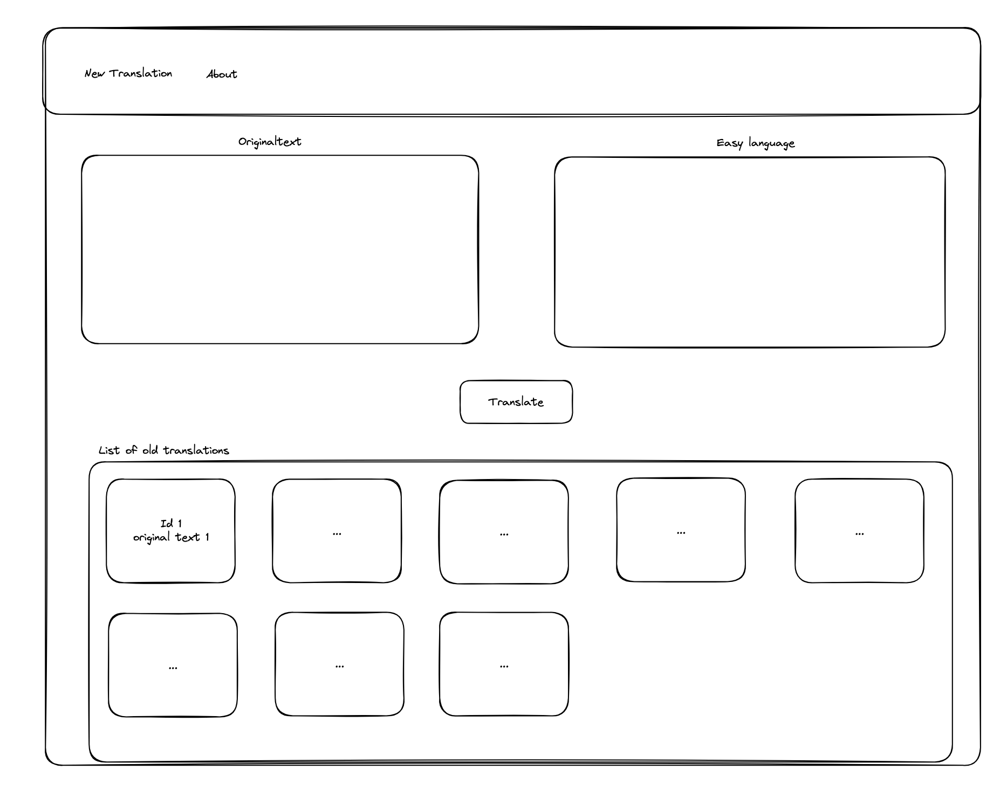

# SUMM AI Frontend challenge

## Welcome! 👋

Thank you for taking the SUMM AI front-end developer challenge.

## The challenge

**Build a React application for our main User Interface**

Here you can see a simple wireframe for the task:

You should implement the functionality of inputting a text in the Originaltext textarea, then click translate and the translated text should appear in the Easy language textarea. You don't need to really transform the text into easy language, just show the same text in the Easy language textarea (or dummy result).  
On the bottom there should be a grid with all previous translations the user did.  
The user should be able to click on a previous translation and the input and output text should appear in a modal where they can be edited.
Everything should be saved in the local storage, so that the user can see the previous translations when he comes back to the page.
There should be also an About page with some dummy text.

# Building your project

- Clone the project to a repo of yours, where you can later send me the link to (do not fork it please)
- Try to commit as you would do in a professional setting because the commits will be reviewed
- Use code / React best practices
- Use functional components
- Use JavaScript ES6+ and optional TypeScript (Bonus) for this project
- Test your code
- Have fun while coding, do not overthink everything :)

## Deploying your project

If you want, you can deploy your site for free. Recommended hosts are:

- [GitHub Pages](https://pages.github.com/)
- [Vercel](https://vercel.com/)
- [Netlify](https://www.netlify.com/)

## Submitting your solution

Write me (Nicholas) an email or a message on LinkedIn/Join when you have completed the project, I will review it afterwards.

**Have fun building!** 🚀

